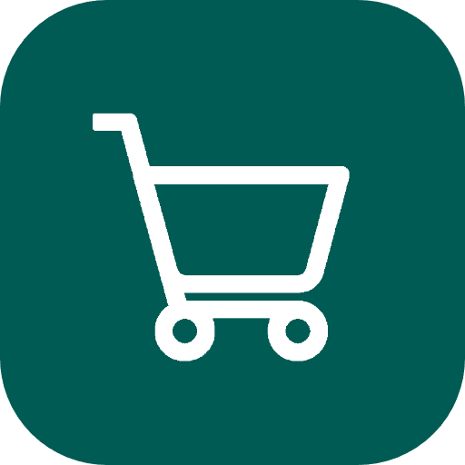

<div align="center">
  
  <h1 align="center">Cenko</h1>
</div>

Cenko brings all deals from major Slovenian stores into one place so you always get the best price. Share shopping lists with family or friends and scan receipts to automatically track your spending. Based on your purchase habits, you also get personalized deal recommendations tailored to what you buy most.

> Dragonhack 2026 - Best use of APIs reward

<div align="center">
    
</div>


## Core features
- **Track spending** - scan receipts to automatically track your spending and gain insights into your spending by store
- **Browse all deals in one place** - find the best deals across all major stores in Slovenia (Mercator, Spar, Hofer, Tuš and Tuš drogerija)
- **Shared shopping list** - create shopping lists and share them with family or friends and make sure you always get the best deal for the products on your list
- **Personalized recommendations** - get deal recommendations based on your shopping list and frequently bought products

## Tech stack
- Flutter for cross-platform mobile development. State management with [Riverpod](https://pub.dev/packages/flutter_riverpod) and navigation with [GoRouter](https://pub.dev/packages/go_router)
- Firebase backend - authentication (with Google or email/password), Firestore database and AI logic
- OCR with Gemini for structured data extraction
- Scraping store deals with a custom Python scraper

## Future improvements
- **Shared shopping lists** - allow users to share shopping lists with family members or friends
- **Support more stores** - scrape catalogs of more stores
- **Price tracking** - track price changes of frequently bought products or shopping lists and notify users of significant price drops
- **Better OCR and data extraction** - improve the accuracy of receipt scanning and data structuring with more advanced LLMs

## Development
**To run the app locally:**
- Install depencides:<br>
`flutter pub get`
- Running in debug:<br>
`flutter run --debug`
- Release build: you will need `android/key.properties` file. Structure of this file can be found in `example-key.properties` file. To run the app in release mode run:<br>
`flutter run --release`

**Firebase stuff:**
- Deploy Firestore rules and indexes:<br>
`firebase deploy --only firestore:rules,firestore:indexes`
- See [Firebase Functions](functions/README.md) for instructions on how to deploy and run functions locally

**To setup the development environment for Android:**
1. Install [Android Studio](https://developer.android.com/studio)
2. Under Tools -> SDK Manager -> SDK Platforms install Android 16.0 ("Baklava")
3. Under Tools -> SDK Manager -> SDK Tools install Android SDK Build-Tools, NDK (Side by side), Android SDK Command-line Tools (latest), CMake, Android Emulator and Android SDK Platform-Tools
4. Create an enulator in Tools -> Device Manager.<br>
Check if emaultor is installed by running  `flutter emuators` and run it via `flutter emulators --launch <emulator id>`
5. Install FlutterFire and Firebase CLI:
    ```bash
    npm install -g firebase-tools
    dart pub global activate flutterfire_cli
    echo 'export PATH="$PATH":"$HOME/.pub-cache/bin"' >> ~/.bashrc # add to PATH
    source ~/.bashrc
    firebase login
    flutterfire configure
    ```

**Secrets:**
- Copy `.env.example` to `.env` and fill in the secrets. Get in touch with the developers if you need access to the secrets.